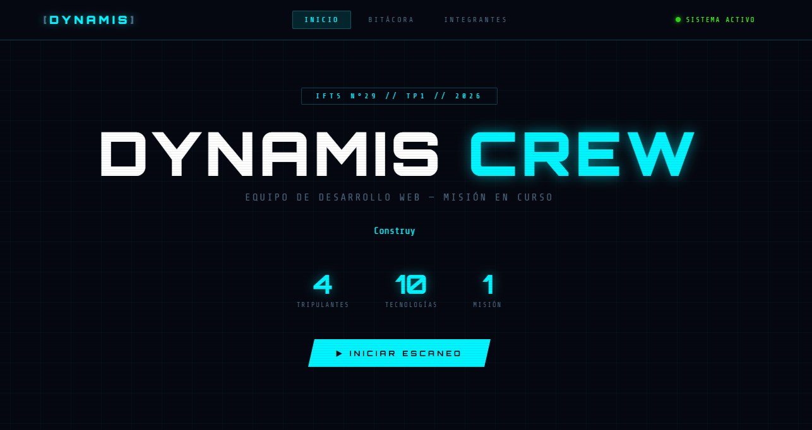
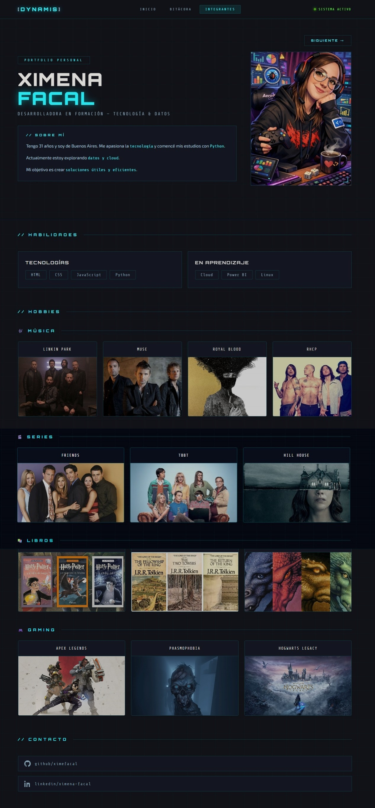
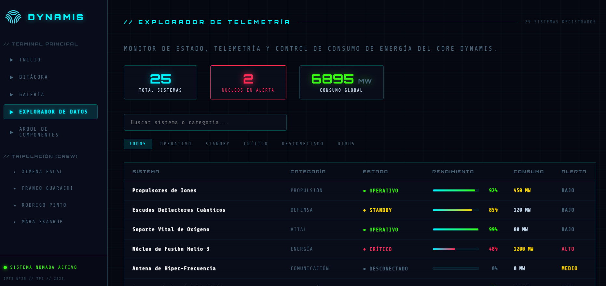
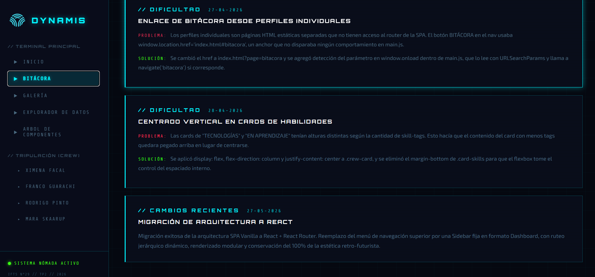

# Trabajo Práctico Grupal 2 — Dynamis Crew | Proyecto React

**[🔗 Link al Deploy en Vercel](https://tp2-front-end-dynamis.vercel.app/)** 

---

## Descripción del Proyecto

**Dynamis Crew TP2** es la evolución del Trabajo Práctico 1, migrado desde una arquitectura HTML/CSS/JS vanilla hacia una **Single Page Application (SPA) en React**. El sitio presenta al equipo de desarrollo con perfiles individuales, explorador de tecnologías con búsqueda en tiempo real, consumo de API externa con paginación, galería con lightbox, bitácora de proyecto y visualización del árbol de componentes. La navegación está centralizada en una Sidebar fija con estética dashboard cyberpunk, gestionada mediante React Router.

---

## Integrantes

| Nombre | GitHub |
|---|---|
| Ximena Facal | [github.com/ximefacal](https://github.com/ximefacal) |
| Franco Guarachi | [github.com/FrancoG31](https://github.com/FrancoG31) |
| Rodrigo Pinto | [github.com/rodgpinto](https://github.com/rodgpinto) |
| Mara Skaarup | [github.com/SkamarluzJH](https://github.com/SkamarluzJH) |

---

## Tecnologías Utilizadas

| Tecnología | Uso |
|---|---|
| **React 19** | Arquitectura de componentes, estado y efectos |
| **React Router DOM v7** | Navegación SPA sin recarga de página |
| **Vite 6** | Bundler y servidor de desarrollo |
| **HTML5** | Estructura semántica base |
| **CSS3** (Flexbox / Grid) | Diseño adaptable y estética cyberpunk |
| **JavaScript ES6+** | Lógica de componentes y hooks |
| **Google Fonts** | Orbitron, Share Tech Mono, Exo 2 |
| **Vercel** | Despliegue continuo |

---

## Estructura de Archivos

```
/
├── public/
│   └── img/
│       ├── ximena/
│       ├── franco/
│       ├── rodrigo/
│       └── mara/
├── src/
│   ├── assets/
│   ├── components/
│   │   ├── Sidebar.jsx       ← Navegación lateral fija
│   │   ├── SkillBar.jsx      ← Barra de progreso animada
│   │   ├── Carousel.jsx      ← Carrusel de proyectos
│   │   └── Lightbox.jsx      ← Visor de imágenes con ESC
│   ├── pages/
│   │   ├── Home.jsx          ← Dashboard principal con tarjetas
│   │   ├── Bitacora.jsx      ← Log de desarrollo del equipo
│   │   ├── DataExplorer.jsx  ← Explorador JSON con filtros
│   │   ├── ApiModule.jsx     ← Consumo de API + paginación
│   │   ├── ComponentTree.jsx ← Árbol de renderizado
│   │   └── members/
│   │       ├── Ximena.jsx
│   │       ├── Franco.jsx
│   │       ├── Rodrigo.jsx
│   │       └── Mara.jsx
│   ├── data/
│   │   └── data.json         ← 20 objetos de tecnologías
│   ├── hooks/
│   │   └── useFetch.js       ← Hook personalizado para API
│   ├── App.jsx               ← Router principal
│   ├── main.jsx              ← Entry point
│   └── index.css             ← Estilos globales (migrados del TP1)
├── index.html
├── vite.config.js
├── vercel.json
└── README.md
```

---

## Guía de Estilos

### Paleta de Colores

| Variable | Hex | Uso |
|---|---|---|
| `--bg` | `#050810` | Fondo principal |
| `--bg2` | `#090d1a` | Fondo secundario |
| `--bg3` | `#0d1225` | Fondo de cards |
| `--cyan` | `#00f5ff` | Acento principal / links |
| `--green` | `#39ff14` | Estado activo / éxito |
| `--red` | `#ff2d55` | Alertas / error |
| `--yellow` | `#ffd700` | Destacados |
| `--text` | `#c8ddf0` | Texto principal |

### Tipografías (Google Fonts)

| Fuente | Uso | Link |
|---|---|---|
| **Orbitron** (400/700/900) | Títulos e interfaz | [Ver fuente](https://fonts.google.com/specimen/Orbitron) |
| **Share Tech Mono** | Datos, etiquetas, código | [Ver fuente](https://fonts.google.com/specimen/Share+Tech+Mono) |
| **Exo 2** (300/400/600) | Cuerpo de texto | [Ver fuente](https://fonts.google.com/specimen/Exo+2) |

### Iconografía

Los íconos de contacto (GitHub, LinkedIn, Behance, email) se implementaron como **SVG inline** sin librerías externas. Las ilustraciones de perfil fueron generadas con IA.

---

## JavaScript / React

### Componentes Clave

#### `Sidebar.jsx`
Navegación lateral fija con `NavLink` de React Router. Aplica clase `active` automáticamente según la ruta actual. Incluye logo del equipo y estado del sistema.

#### `Home.jsx`
Dashboard principal con grilla dinámica de tarjetas por integrante. Implementa animación de entrada con `useState` + `useEffect` + transición CSS (`opacity` / `translateY`). Navegación a perfiles individuales con `useNavigate`.

#### `SkillBar.jsx`
Barra de progreso animada con `useEffect` y `setTimeout`. La barra crece desde 0% hasta el nivel definido con transición CSS de 1.2 segundos y efecto de glow cyan.

#### `Carousel.jsx`
Carrusel manual con estado de índice activo. Controles anterior/siguiente con navegación circular. Muestra imagen, título y descripción del proyecto seleccionado.

#### `Lightbox.jsx`
Visor de imágenes en pantalla completa. Cierre con tecla **ESC** via `useEffect` + `addEventListener`. Navegación interna entre imágenes con botones anterior/siguiente.

#### `DataExplorer.jsx`
Renderiza dinámicamente 20 objetos del archivo `data.json`. Filtrado en tiempo real por texto (input) y por categoría (select). Muestra contador de resultados. Usa `useState` sin dependencias externas.

#### `ApiModule.jsx` + `useFetch.js`
Consumo asíncrono de [PokeAPI](https://pokeapi.co). El hook `useFetch` maneja estados de `loading`, `data` y `error`. Paginación con indicador de página actual y rango de registros mostrados.

#### `ComponentTree.jsx`
Representación visual del árbol de renderizado del proyecto en formato terminal/ASCII, consistente con la estética cyberpunk del sitio.

### Perfiles Individuales

Cada perfil (`Ximena`, `Franco`, `Rodrigo`, `Mara`) es un componente independiente que incluye hero con foto, descripción, `SkillBar` × 5, `Carousel` de proyectos, sección de hobbies y contacto con SVG inline. Navegación entre perfiles con `useNavigate`.

---

## Capturas de Pantalla


### Home — Dashboard


### Perfil Individual


### Explorador de Datos


### API Externa


### Bitácora


---

## Enlace al Proyecto Desplegado

**[🔗 Ver en Vercel](https://tp2-front-end-dynamis.vercel.app/)** 

---

## Evolución respecto al TP1

### Migración de HTML/JS Vanilla → React

| Aspecto | TP1 (Vanilla) | TP2 (React) |
|---|---|---|
| Arquitectura | SPA manual con `innerHTML` | Componentes React con JSX |
| Navegación | `window.location.href` / query params | React Router DOM v7 |
| Estado | Variables globales JS | `useState` / `useEffect` |
| Estilos | Un archivo CSS global | CSS global + inline styles por componente |
| Perfiles | 4 archivos HTML independientes | 4 componentes JSX reutilizables |
| API | No implementada | `useFetch` hook + PokeAPI |
| Datos locales | No implementado | JSON con filtrado en tiempo real |
| Galería | No implementada | Grid + Lightbox con ESC |
| Deploy | Vercel (HTML estático) | Vercel (Vite build + `vercel.json`) |

### Mejoras de Interfaz
- Sidebar fija reemplaza el navbar horizontal del TP1
- Barras de progreso animadas en perfiles individuales
- Carrusel interactivo de proyectos
- Lightbox con navegación y cierre por teclado
- Animaciones de entrada en el dashboard principal
- Hook personalizado `useFetch` con manejo de estados

---

## Árbol de Renderizado

```
App
└── BrowserRouter
    ├── Sidebar
    │   ├── Logo [DYNAMIS]
    │   ├── NavLink → /
    │   ├── NavLink → /bitacora
    │   ├── NavLink → /explorador
    │   ├── NavLink → /api
    │   └── NavLink → /arquitectura
    └── Routes
        ├── Route "/" → Home
        │   └── MemberCard × 4 (con animación fadeUp)
        ├── Route "/integrante/ximena" → Ximena
        │   ├── SkillBar × 5
        │   ├── Carousel (3 proyectos)
        │   └── HobbyGrid + ContactLinks
        ├── Route "/integrante/franco" → Franco
        │   ├── SkillBar × 5
        │   ├── Carousel (3 proyectos)
        │   └── HobbyGrid + ContactLinks
        ├── Route "/integrante/rodrigo" → Rodrigo
        │   ├── SkillBar × 7
        │   ├── Carousel (3 proyectos)
        │   └── HobbyGrid + ContactLinks
        ├── Route "/integrante/mara" → Mara
        │   ├── SkillBar × 5
        │   ├── Carousel (3 proyectos)
        │   └── HobbyGrid + ContactLinks
        ├── Route "/bitacora" → Bitacora
        │   └── LogEntry × N
        ├── Route "/explorador" → DataExplorer
        │   ├── SearchInput (filtro texto)
        │   ├── FilterSelect (filtro categoría)
        │   └── DataCard × 20 (data.json)
        ├── Route "/api" → ApiModule
        │   ├── useFetch (hook personalizado)
        │   ├── Loader / ErrorMsg
        │   ├── PokemonCard × 12
        │   └── Pagination (Anterior / Página N / Siguiente)
        └── Route "/arquitectura" → ComponentTree
            └── Árbol ASCII del proyecto
```

---

## Uso de IA

| Herramienta | Uso en el proyecto |
|---|---|
| **Claude (Anthropic)** | Guía de migración TP1→React, generación de componentes JSX, estructura de carpetas, lógica de hooks, debugging de errores, generación de este README |
| **ChatGPT / Gemini** | Consultas puntuales de sintaxis React y CSS |
| **IA generativa de imágenes** | Ilustraciones de perfil de integrantes con estilo cyberpunk/cómic |

### Detalle de uso
- **Código:** La IA asistió en la arquitectura de componentes, el hook `useFetch`, el componente `Lightbox` con cierre por ESC y la lógica de filtrado del `DataExplorer`. El equipo revisó, adaptó e integró todo el código manteniendo la autoría del proyecto.
- **Contenido:** Los textos de presentación de cada integrante fueron escritos por los propios integrantes. La IA ayudó a estructurar el README.
- **Imágenes:** Las ilustraciones de perfil fueron generadas con herramientas de IA con prompts de estilo "cyberpunk digital illustration, developer portrait" manteniendo coherencia visual con la temática del proyecto.